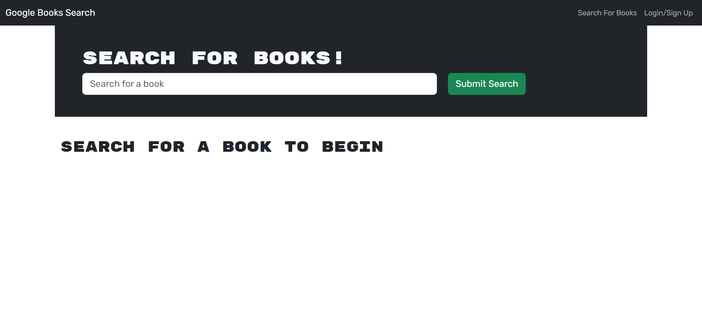

# MERN Book Search Engine

## Description

This is a book search engine that allows users to create an account and save books to their own collection. It is set up using the MERN stack. It uses MongoDB and the apollo client for the database and schemas, express and nodejs for the middleware, and react for the frontend UI. The deployed app can be found here: https://book-search-engine-mern-kb1s.onrender.com/

## Table of Contents

- [Installation](#installation)
- [Usage](#usage)
- [Images](#images)
- [License](#license)
- [Contributing](#contributing)
- [Tests](#tests)
- [Questions](#questions)

## Installation

N/A

## Usage

This project is being used as practice with the MERN stack. It is important as a web developer to have experience with this stack and this project is a way for me to familiarize myself with the database side of the MERN stack.

## Images

## License

This project is licensed under the MIT - see the [LICENSE](https://opensource.org/licenses/MIT) for details.

## Contributing

N/A

## Tests

N/A

## Questions

Got questions? Reach out to me on [GitHub](https://github.com/Jarede712) or by [email](mailto:jaredeichhorst@gmail.com).
